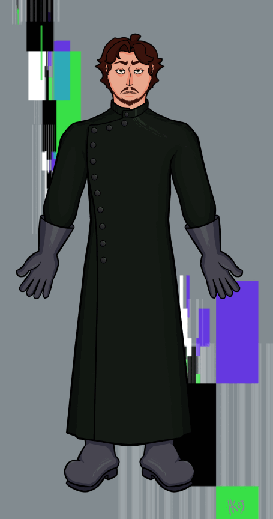
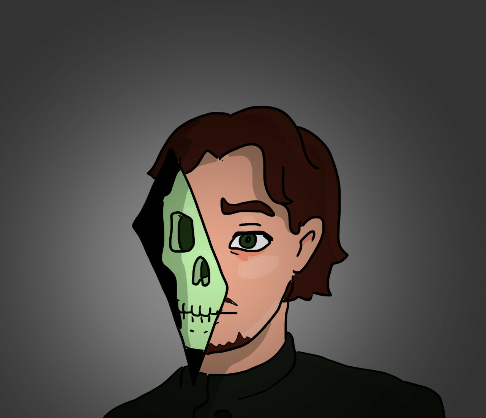

[Refsheet](https://refsheet.net/youhoo1234/absinthe){:target="\_blank"}

<figure>

<figcaption>Dr. Absinthe by <a  href="https://luqlustra.tumblr.com/" target="\_blank">Luqlustra</a></figcaption>
</figure>

Gallery

 <!-- The grid: four columns -->

  

    
  

  

    
  

  

    
  

<!-- The expanding image container -->

  <!-- Close the image -->
  &times;

  <!-- Expanded image -->
  

  <!-- Image text -->
  

 
 

<table class="character-table">
    <tr>
        <td>Species</td>
        <td>Human (Bound - Uranium)</td>
    </tr>
    <tr>
        <td>Gender</td>
        <td>Transmasc (He / They)</td>
    </tr>
    <tr>
        <td>Height / Weight</td>
        <td>5'3" (1.6m) / 120lbs (54kg)</td>
    </tr>
    <tr>
        <td>Body Type</td>
        <td>Bones</td>
    </tr>
    <tr>
        <td>Age</td>
        <td>~250</td>
    </tr>
    <tr>
        <td>Birthday</td>
        <td>29 November</td>
    </tr>
    <tr>
        <td>Sexuality</td>
        <td>Bisexual</td>
    </tr>
</table>

Setting

I have played Dr. Absinthe in a cyberpunk red game and once in a normal DnD setting. However, their character originates from an original setting I've been making (and hope to do some writing with and run some Monster of the Week games in when I have time). It takes place in an alternate future, where society has collapsed and started to rebuild, and people can be bound to different elements. It's a little bit magical detective stories, a little bit cyberpunk, a little bit solarpunk, and a little bit whacky fun. Anyways, the main elements no matter what the setting is for Dr. Absinthe are that he's unhinged, a doctor of some sort, and has daddy issues. 

Appearance

<b>Skelly Form:</b> Their bones are a light green and will glow in dim light or when using his powers. His eye sockets also have a glowing light in them. 

<b>Human Form:</b> He has lightly wavey auburn brown hair, light facial hair (usually some form of goatee and mustache), and green eyes.

Their fashion varies by time and setting, but usually it's a little dramatic.

Personality

They have a bit of a Machiavellian flair, being very patient and cunning when it comes to accomplishing their goals. At the same time, he easily falls into overindulgence of whatever is his current vice. He does not make friends easily, but when he does they're fiercely loyal. Basically, they're a man of extremes. He's not one to half ass things.

About Dr. Absinthe

Dr. Absinthe is a semi-immortal radioactive skeleton. At least they are now. He has a medical and research background studying biological energy. His main goal now is to undo the magical process that caused him to be immortal. 

<b>Family:</b> only child. Had a difficult time connecting with their mom, but all in all was on good terms. Did NOT get along with his father despite working with him for years.

<b>Friends:</b> not many! He did have one friend that eventually became his lover. She was basically the thing keeping him anywhere remotely sane after being bound. After that, he purposely tries to keep emotional distance between themselves and mortals.

Backstory

Jon comes from a wealthy family. He had a decent but distant relationship with his mother, though she died when they were around 18. They never really had a good relationship with his father, who cold, impossible to please, and considered his word as law. After finishing his medical training, they ended up working with his father despite their strained relationship. His father ran a research center that studied novel energy production methods. At this job, Jon started to fall for one of the lab technicians (who I haven’t settled on a name for yet). Meanwhile, their research with their father started to deteriorate as they had to work together more often, and his father began to sink more and more time into strange and mystical research. Eventually, their disagreements came to a head and his father decided to use him for his final tests. His father had discovered a way of creating a truly self renewing energy source by magically binding a living creature to a radioactive material… in this case Jon with Uranium. 

During the process and the aftermath of the shock he killed his father. His love interest helped keep him somewhat sane at first, helping him learn to control his new powers and parse through his father’s secret research. After discovering the true nature of what happened to him, his goal became to find out how to undo the magical process that bound him to this earth and became increasingly willing to accomplish that goal by any means necessary. Along the way he picked up the name Dr. Absinthe from the green glow of his skeleton.

Abilities

    <ul>
      <li><b>Soul Spike:</b> Can create binding spike from his own essence, which can in turn be used to bind people to himself. Used for all sorts of nefarious purposes from spying to straight up controlling an individual.</li>
      <li><b>Master Binder:</b> Can create binding spikes from most common essences with ease, and has the resources and equipment to create rare ones.</li>
      <li><b>Soul Sight:</b> Not having eyes is weird. His sight is more based on the “souls” of things than their physical imprint.</li>
      <li><b>Radiance:</b> He's made of uranium now. Literally can just give you cancer.</li>
    </ul>

Relationships

    <ul>
        <li><b>Family:</b> .</li>
        <li><b>Friends:</b> .</li>
    </ul>

Backstory

<table style="width: auto; float: none;">
    <tr>
        <td>Likes</td>
        <td>Fashion, Industrial music, Knowledge</td>
    </tr>
    <tr>
        <td>Dislikes</td>
        <td>Being a glowing green skeleton (not really ideal!), His dad, People that get in his way, Pets (some cats are ok)</td>
    </tr>
</table>

