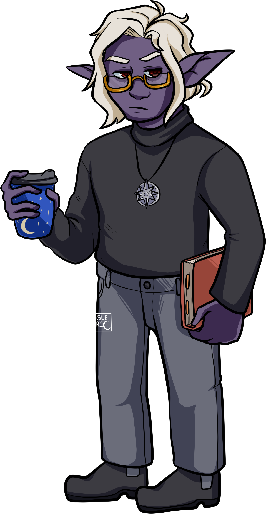

| Species | Elf (Drow) |
| Gender | Man (He / Him) |
| Height / Weight | 5'3" (1.6m) / 130lbs (69kg)|
| Body Type | Lean |
| Age | 127 |
| Birthday | 3 July |
| Class | Arcana Cleric / Rogue |
| Sexuality | Demi / Bisexual (disaster variety) | 

<figure>

<figcaption>Damien by <a  href="https://twitter.com/plaguecleric" target="\_blank">Plague Cleric</a></figcaption>
</figure>

Setting

I originally created Damien as a side / backup character for the DnD game I play in. It's set in a slightly homebrewed Forgotten Realms setting (basically, little bit of steampunk added by virtue of it being a bit "in the future" of the current 5e setting and plenty of VR's guide / dread plane shenanigans involved).

