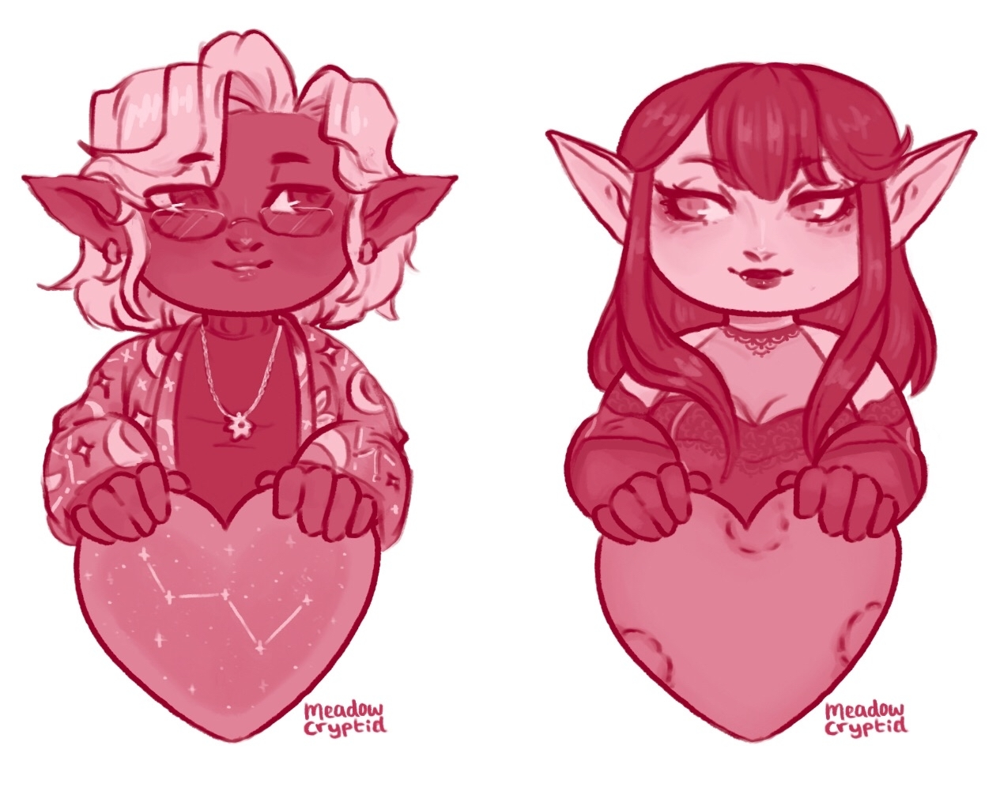

[Refsheet](https://refsheet.net/youhoo1234/damien){:target="\_blank"}

<figure>

<figcaption>Damien by <a  href="https://twitter.com/plaguecleric" target="\_blank">Plague Cleric</a></figcaption>
</figure>

Gallery

 <!-- The grid: four columns -->

  

    
  

  

    
  

  

    
  

  

    
  

  

    
  

  

    
  

  

    
  

  

    
  

<!-- The expanding image container -->

  <!-- Close the image -->
  &times;

  <!-- Expanded image -->
  

  <!-- Image text -->
  

 
 

<table class="character-table">
    <tr>
        <td>Species</td>
        <td>Elf (Drow)</td>
    </tr>
    <tr>
        <td>Gender</td>
        <td>Man (He / Him)</td>
    </tr>
    <tr>
        <td>Height / Weight</td>
        <td>5&#39;3&quot; (1.6m) / 130lbs (69kg)</td>
    </tr>
    <tr>
        <td>Body Type</td>
        <td>Lean</td>
    </tr>
    <tr>
        <td>Age</td>
        <td>127</td>
    </tr>
    <tr>
        <td>Birthday</td>
        <td>3 July</td>
    </tr>
    <tr>
        <td>Class</td>
        <td>Arcana Cleric / Rogue</td>
    </tr>
    <tr>
        <td>Sexuality</td>
        <td>Demi / Bisexual (disaster variety)</td>
    </tr>
</table>

Setting

I play Damien a slightly homebrewed Forgotten Realms setting (basically, little bit of steampunk has been added since it's "in the future" of the current 5e timeline, plenty of VR's guide / dread plane shenanigans, and ignoring any problematic WoTC weirdness).

Appearance

Damien wears mostly dark or neutral colors and classier styles, but wears outfits with a little more flair to it on occassion. I change his hair around every so often, so the exact style and whether he does or doesn't have facial hair is fluid. The symbols on his necklace are the symbols of Mystra and Eilistraee. He also has a holy symbol of Mystra that he doesn't always wear openly but always has on his person. He doesn't need glasses to see, but he does have a pair of magical golden glasses (explained below) that he wears while reading.

Personality

Damien tends towards the pessimistic side. He is quiet and reserved, preferring to be by himself or with a few close friends than in a crowd. He tries to maintain an image of indifference, but inside he's actually quite caring and a complete softy. When confronted with trouble (usually self-inflicted) his first instinct is to deflect and run away from his problems (he's working on that). While he usually tries to maintain a straight face, he tends to wear his heart on his sleeve if you know what to look for. When his emotions do boil over, his mouth tends to get him in trouble. If met with his anger, you'll usually find apology coffee waiting for you the next day.

About Damien Simmyns

Damien is currently a library assistant and researcher at the Clocktower (or more officially, Kas Institute of Magic). The university has been in a strange position lately, as when the alchemy lab exploded, it found itself transferred to plane of dread. After some investigation, the party and some other faculty members discovered the university's chancellor along with some of the faculty were using the population of the neighboring town as unwitting test subjects in a biological weapons test. Now, he and a group of faculty and older students are working to stop the chancellor and the experiment he released onto the public.

Abilities

<b>Strength:</b> Very Low || <b>Dexterity:</b> High || <b>Constitution:</b> Average || <b>Intelligence:</b> Very High || <b>Wisdom:</b> Low || <b>Charisma:</b> Average
    <ul>
        <li>Very knowledgeable about magic, religion, and history. Particularly in his research fields of metamagics and arcane teaching methods. He also knows a great deal of Drow history and about Eilistraee's and Mystra's religions.</li>
        <li>Skilled at Calligraphy. Also has some experience forging documents.</li>
        <li>Fencing / Rapier</li>
    </ul>

Relationships

    <ul>
        <li><b>Family:</b> his mother is a priestess of Eilistraee and his father is a historian. He has a younger sister that's much more outgoing. They live just outside of Silverymoon.</li>
        <li><b>Friends:</b> he has a friend back in Silverymoon named Alex who is a half-elf. Think golden retriever incarnate. At the Clocktower, he lives with another drow elf, Kieran, who is his opposite in almost every way. Overtime they've grown to be friends. He also enjoys speaking with the librarian and students. Currently he is in a relationship with the school's student advisor, Jacqueline, a vampire with high elf heritage.</li>
    </ul>

Items and Other

    <ul>
        <li><b>Glasses:</b> his golden glasses are an antique found deep in the library back when he was still a grad student. They let him read any written language.</li>
        <li><b>Holy symbol:</b> a simple holy symbol of Mystra given to him as a gift by his friend Alex.</li>
        <li><b>Emerald pen:</b> a magical antique pen that allows him to cast illusory script at will. Usually he uses it to obfuscate his research notes when in public. It was a gift from his parents.</li>
        <li><b>Juniper:</b> his familiar. Usually appears as a sphynx cat when with Damien. They're also the same fey spirit that's Alex's familiar, though with him Juniper appears as a puppy.</li>
    </ul>

Backstory

Damien grew up outside of Silverymoon and attended the university there. In his further graduate studies, things started to take a turn for the worse. His older human advisor started to grow impatient with the elf's slow, methodical research pace, and Damien found himself failing his qualification exams. His advisor decided to take things into his own hands and publish Damien's almost completed research himself, drawing conclusions Damien found inaccurate and distasteful. As for his failing academic performance, this was due to him becoming a cleric of Mystra in a college of wizards. Things came to a head when the college found he had taken a pair of magical glasses from the library. Since he was already on academic probation and, to the university's eyes, hadn't published anything in a reasonable amount of time, he was expelled. After this he ran off, glasses and research notes in tow. He fell into faking his credentials and petty scams until finally making his way to the Clocktower, where a forged CV and scuffed interview somehow landed him a job as a library assistant. At first he tried to lay low and hide away, fearful that others would discover he was a fraud. However, as of late, he has instead taken the opportunity to turn over a new leaf and finally get his life back on track.
<ul>
    <li><a href="https://docs.google.com/document/d/1V0UZQQ8-vBJBUZF3M_NDI5ZvAgk3hqBvsiuwqyNPnv4/edit?usp=sharing" target="\_blank">Story that takes place right before going to the Clocktower</a></li>
    <li><a href="https://docs.google.com/document/d/1HGxvtFz1_FtKQTxaWo4VIJjGo9FhIDOxBSsZlxro9IU/edit?usp=sharing" target="\_blank">Short story about his days as a student</a></li>
    <li><a href="https://docs.google.com/document/d/1fkTxMJMt_-ebPP6jngsAasbdRlElSYII93g_wNAFBHk/edit?usp=sharing" target="\_blank">Juniper short story</a></li>
</ul>

<table style="width: auto; float: none;">
    <tr>
        <td>Likes</td>
        <td>Iced coffee, Quiet, Jacqueline, Research, Mystra</td>
    </tr>
    <tr>
        <td>Dislikes</td>
        <td>Crowds, Clutter, Alcohol, Academic elitism</td>
    </tr>
</table>

