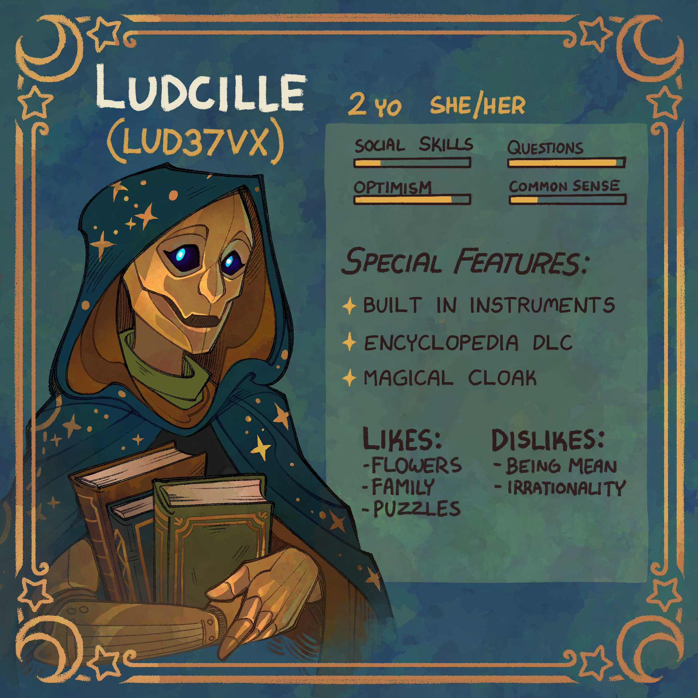
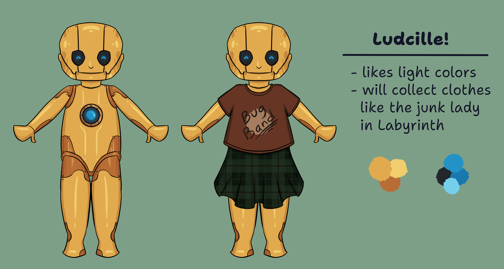
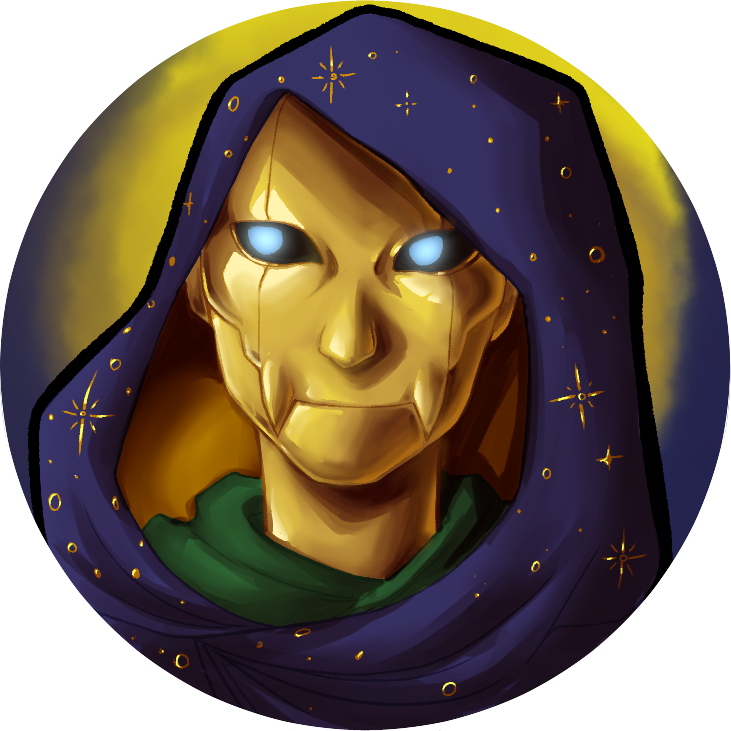
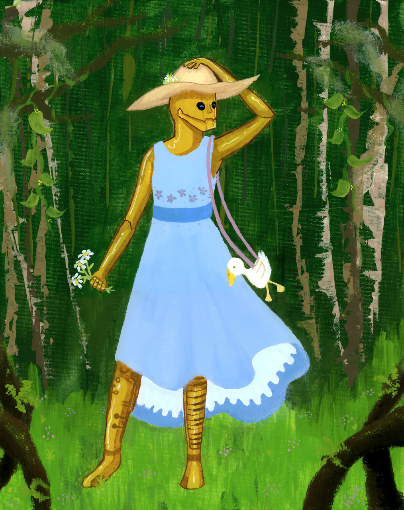
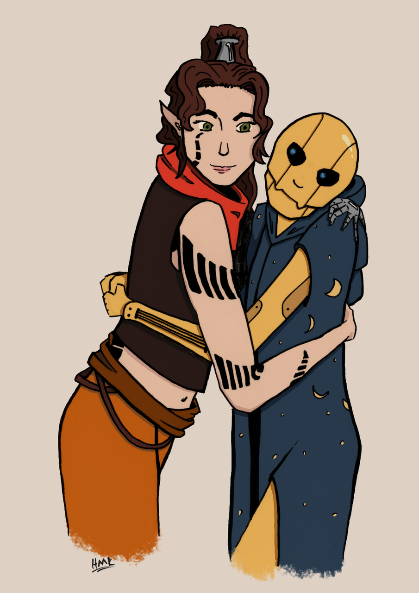
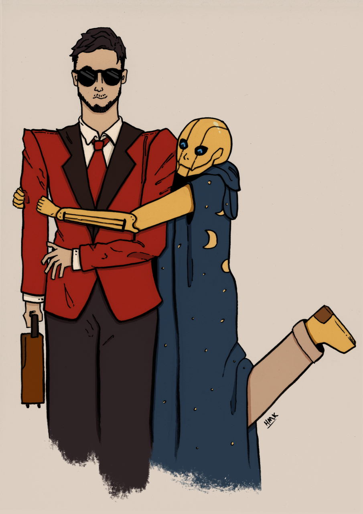
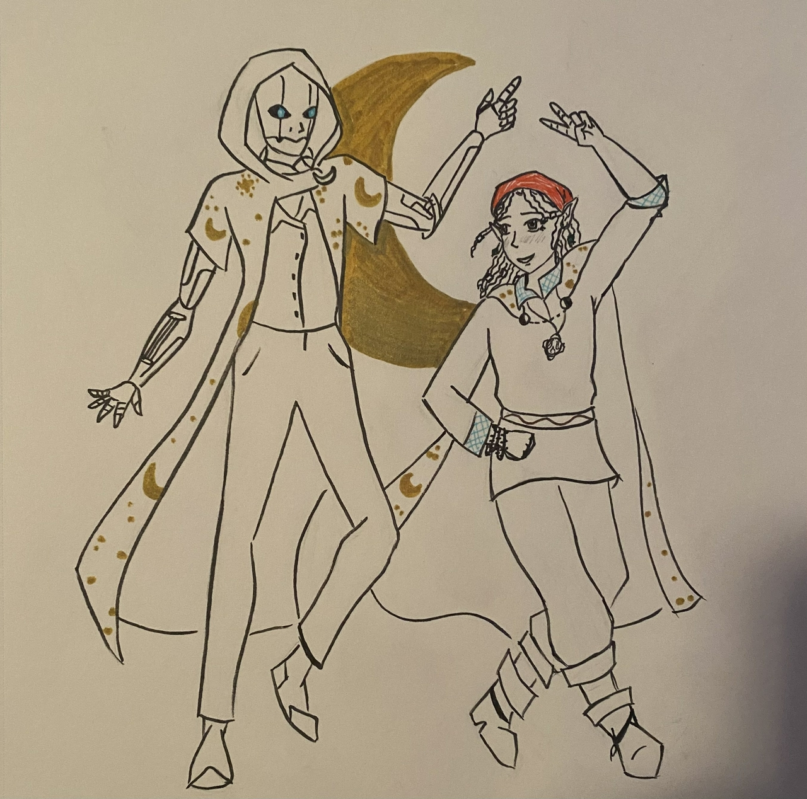
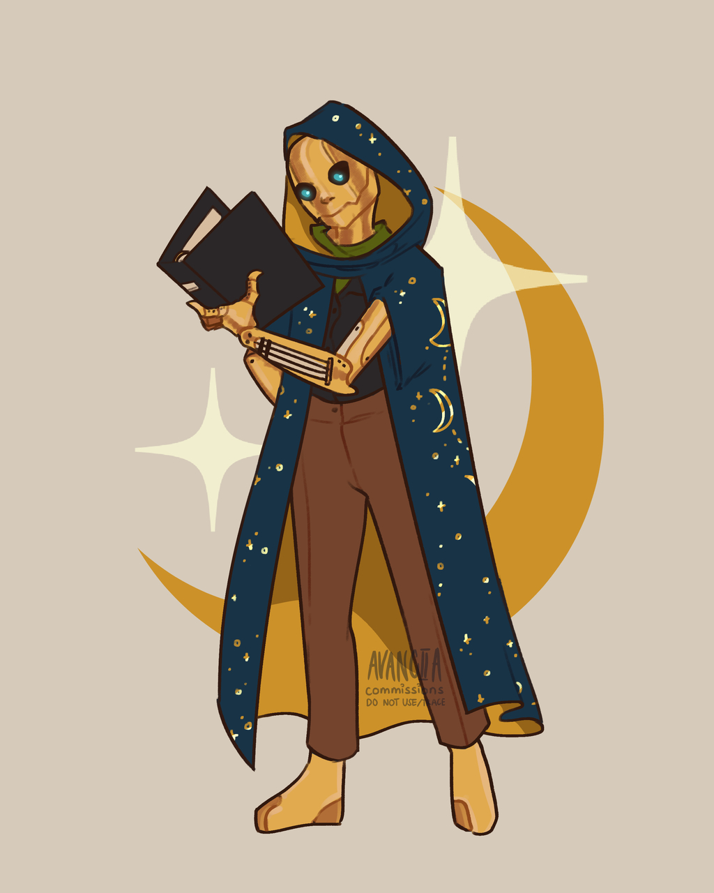

[Refsheet](https://refsheet.net/youhoo1234/ludcy){:target="\_blank"}

<table>
    <tr>
        <td>Species</td>
        <td>Clockwork Automaton (LUD37VX)</td>
    </tr>
    <tr>
        <td>Gender</td>
        <td>Robot (SHE / HER)</td>
    </tr>
    <tr>
        <td>Height / Weight</td>
        <td>5'6" (1.7m) / 220lbs (100kg)</td>
    </tr>
    <tr>
        <td>Body Type</td>
        <td>Metal</td>
    </tr>
    <tr>
        <td>Age</td>
        <td>2</td>
    </tr>
    <tr>
        <td>Birthday</td>
        <td>13 July</td>
    </tr>
    <tr>
        <td>Class</td>
        <td>Creation Bard | Circle of Stars Druid</td>
    </tr>
    <tr>
        <td>Sexuality</td>
        <td>Aro / Ace</td>
    </tr>
</table>
<figure>

<figcaption style="margin-bottom: 8.5em">Ludcille by <a  href="https://linktr.ee/parziivale" target="\_blank">Parziivale</a></figcaption>
</figure>

Gallery

 <!-- The grid: four columns -->

  

    
  

  

    
  

  

    
  

  

    
  

  

    
  

  

    
  

  

    
  

  

    
  

<!-- The expanding image container -->

  <!-- Close the image -->
  &times;

  <!-- Expanded image -->
  

  <!-- Image text -->
  

 
 

Setting

I play Ludcille a slightly homebrewed Forgotten Realms setting (basically, little bit of steampunk has been added since it's "in the future" of the current 5e timeline, plenty of VR's guide / dread plane shenanigans, and ignoring any problematic WoTC weirdness).

Appearance

Ludcille is a golden colored sentient clockwork automaton. She was created to play music in upscale bars and taverns, and so features several instruments built into her body. Her left arm features a guitar, left leg a clarinet, and right leg a keyboard. In the center of her chest is a blue core that functions as her "heart" and "brain." Her vision sensors are black and glassy with a blue light emanating from within. She has several different outfits, but will wear just about anything she is given. This includes a blue floral dress, her starry constellation cloak, a shirt that says "Bug Band" on it, an old timey swimsuit, and a Victorian / steampunk suit. 

Personality

Ludcille is very literal and struggles to understand nuance and idioms. To her, most things in the world are simply black and white. Being a sentient construct, she also has trouble with emotions. She does have feelings, but they tend to be very in the moment, very intense, and dissipate quickly. She is very curious about the world around her and wants to understand everything. She also likes nature and its ordered beauty. Overall, she basically has the experience and naivety of a child but the mental capacity of an adult (but robotic).

About Ludcille

Ludcille is currently traveling with an adventuring party tasked with gathering intelligence and improving relations with key people in a dread plane. Should she be there? No. Should she even have a job? Also probably no, but this is DnD and here we are. She's also currently a trainee junior detective and loves every second of it. Her druidic abilities some from a strange, god-like being in the form of a goose that has been contacting her since arriving in the dread plane.

Abilities

<b>Strength:</b> Very Low || <b>Dexterity:</b> Average  || <b>Constitution:</b> Very High || <b>Intelligence:</b> High || <b>Wisdom:</b> Very High || <b>Charisma:</b> Average
    <ul>
        <li>She is very perceptive and insightful, though due to her inexperience she sometimes struggles to interpret what she notices about people.</li>
        <li>She can play many instruments, including a contrabass saxophone and accordion.</li>
        <li>She dislikes fighting but when necessary uses chakrams, claws, or spells.</li>
    </ul>

Relationships

    <ul>
        <li><b>Family:</b> technically, she has no family. However, she stayed with a family of tortles for a time when she was first gaining sentience. She also considers her changeling friend Xana to be her sister.</li>
        <li><b>Friends:</b> Ludcille will consider anyone who is vaguely nice to her a friend. Her "friends" do not always agree. Really, she is closest with those in the party, especially the lawyer in the party Arael that has taken to teaching her.</li>
    </ul>

Items and Other

    <ul>
        <li><b>Regalia of the Dark Lady:</b> her magical constellation cloak that was gifted to her by a follower of Eilistraee. She also modified it with another magic item so now it can let her enter the ethereal or teleport an ally away from danger.</li>
        <li><b>Whistle of the Wild:</b> a whistle that lets her cast animal friendship</li>
        <li><b>Bug Band shirt:</b> this isn't magical, she just likes it. From a bug rock concert by a group of Thri-Kreen.</li>
        <li><b>Cindered Heart:</b> a magical necklace made for her that contains the spirit of a powder monkey.</li>
        <li><b>Scissors of Shadow Snipping:</b> giant scissors that can detach a shadow from someone. She's now friends with her own shadow.</li>
    </ul>

Backstory

Ludcille used to reside in an upscale tavern called the Lavender Longue. Over time, she slowly started to gain sentience. Her owner was oblivious to this, and his mistreatment of her came to a head when he threatened to have her core reset. He attempted to restrain her in the tavern's backroom until he could contact the company that created her for maintenance, but in a panic Ludcille resisted and escaped. In the process she was injured and her owner died, but this barely registered to her. She was found by another construct and investigator Quintin (my character Flossie's husband) who made sure she got help and shelter. Later she met Xana and the two became fast friends. They then applied to the same job, which ended up being the adventuring party she now travels with.

<ul>
    <li><a href="https://docs.google.com/document/d/1SjglZZqY-l3_n2comGD6Gu6YD97ZU6qmN4GQAhpL-JY/edit?usp=sharing" target="\_blank">Story about her gaining sentience</a></li>
    <li><a href="https://drive.google.com/file/d/1D89Ewsxh7l1suEyeik2JKzHocpnz0oSq/view?usp=sharing" target="\_blank">Ludcille's manual</a></li>
</ul>

<table style="width: auto; float: none;">
    <tr>
        <td>Likes</td>
        <td>Flowers!, Her sister Xana, Her friends, Goose!, Music, Making things, Attention</td>
    </tr>
    <tr>
        <td>Dislikes</td>
        <td>People being mean, Things that don't make sense, Being ignored</td>
    </tr>
</table>

